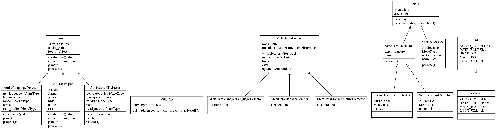

# VoiceScraping

## Project Overview
`VoiceScraping` is a Python project allowing users to download audio files from this [website](https://www.voiptroubleshooter.com/open_speech/index.html). It will store the metadata for each audio file downloaded. In addition, it will run Machine Learning models to detect if there is any speech and which language is spoken in each audio file, and also record the metata data in the disk.

## Class diagram:



This class diagram is created by using the below commands from the project folder:

```bash
# create a dot file
pyreverse ./src

# convert the dot file into a png file
dot -Tpng classes.dot > classes.png
```

## Dependencies:

- For the dependencies, please run the below command to install dependencies from [env.yml](env.yml):
```bash
$ conda env create -f env.yml
```

## Commands:

- Run the service:
```bash
$ conda activate VoiceScraping
$ python ./src/main.py
```


## Download Docker image

Please go to this [Docker website](https://hub.docker.com/r/tdkhanhvu/voice-scraping) to pull a Docker image of this project.


## Build Docker image

Please use this command to build this Docker image

```bash


```

## How to introduce a new model into this project

Assume that you want to introduce a new model called [NumberDetector](https://pytorch.org/hub/snakers4_silero-vad_number/), you need to create these 3 new classes:

- `MetaDataManagerNumberDetector` inherits from `MetaDataManager`: This class manages the metadata stored in the disk for this service and includes the headers of the data.
- `AudioNumberDetector` inherits from `Audio`: This class manages how we can convert the audio into the appropriate data using the model that we want to introduce and produces the record for `MetaDataManagerNumberDetector` to update in the disk.
- `ServiceNumberDetector` inherits `ServiceMLDetector`: This class maps the link between `MetaDataManagerNumberDetector` and `AudioNumberDetector` above.

## Constraints

Below are the constraints of this project:

**1. Layout out of the scraped website is fixed**

Currently the way the scraper works is based on the layout of this [website](https://www.voiptroubleshooter.com/open_speech/index.html). If the user would like to scrape another website, they have to implement their own `Language` and `AudioScraper` classes.

**2. Structure of meta data stored is fixed**

Similarly, the structure of meta data stored is tighly coupled with the above website, assuming that it will have a column called **name** in the table. In addition, the headers of tables are currently hard-coded. Even though we do not expect the headers will change frequently, this still represents a drawback in our design. Nevertheless, this is the chosen approach since if we dynamically load the new headers, it may contradict with the existing headers stored in the previous metadata files. 

**3. Meta data record is not updated if changed**

Currently, we do not update the meta data record if it already exists in the meta table stored in the disk. However, the audio provider may update the same file name with new details, such as a higher audio quality. We can update the existing record if it happens and redownload the audio.

**4. Audio is not redownloaded if it is changed**

As of now, we do not redownload the audio files that were downloaded before. However, there is a possibility that the audio provider may have uploaded a new version of the file, such as to correct the corrupted file like `OSR_us_000_0058_8k.wav`. We can redownload the file every time, but we believe that it is inefficient, especially if there are hundreds of thousands of files. Instead, the audio provider can present a way for us to know if the file is updated, such as a checksum. If it is the case, we can compare the old checksum and the new one and download those that are updated.

**5. Meta data only persists to the disk at the end**

We only persist the latest meta data to the disk once at the end of the operation. This poses a potential risk if the program is stopped in the middle. Instead, we should save the new meta data incrementally.

## Contributors

We welcome and recognize all contributions. You can see a list of current contributors in the [contributors tab](https://github.com/tdkhanhvu/VoiceScraping/graphs/contributors).

- Tran Doan Khanh Vu